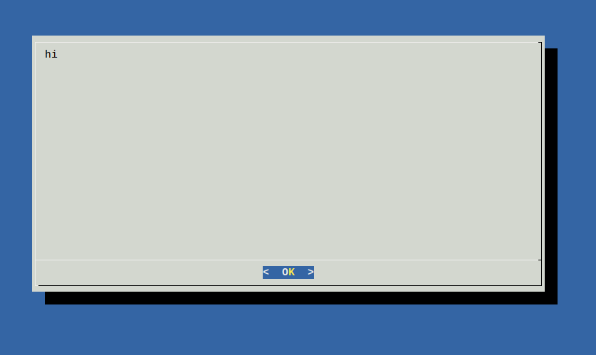
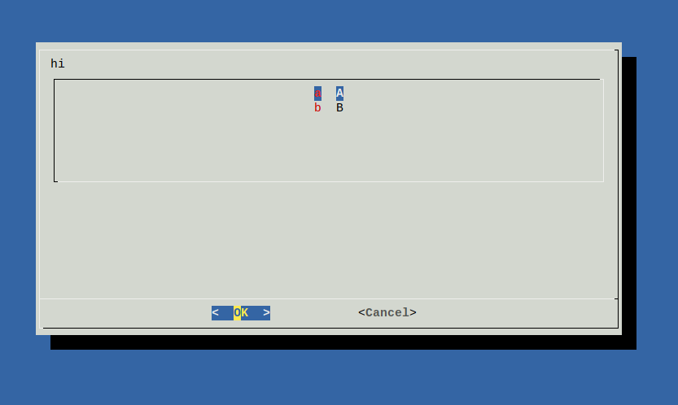

# dialog

Simple wrapper for the `dialog` executable.

[](http://godoc.org/github.com/xyproto/dialog) [](https://raw.githubusercontent.com/xyproto/dialog/master/LICENSE) [](http://goreportcard.com/report/xyproto/dialog)




## Example use

```go
package main

import (
	"fmt"
	"github.com/xyproto/dialog"
)

func main() {
	d := dialog.New(80, 20)
	d.MsgBox("hi")
	answer := d.Menu("hi", 6, map[string]string{"a": "A", "b": "B"})
	fmt.Printf("\n\n\n\n%s\n", answer)
}
```

The path to `dialog` is `/usr/bin/dialog` by default, but can be changed with the `SetPath` function.

## General info

* Version: 1.0
* License: MIT
* Author: Alexander F. Rødseth &lt;xyproto@archlinux.org&gt;
